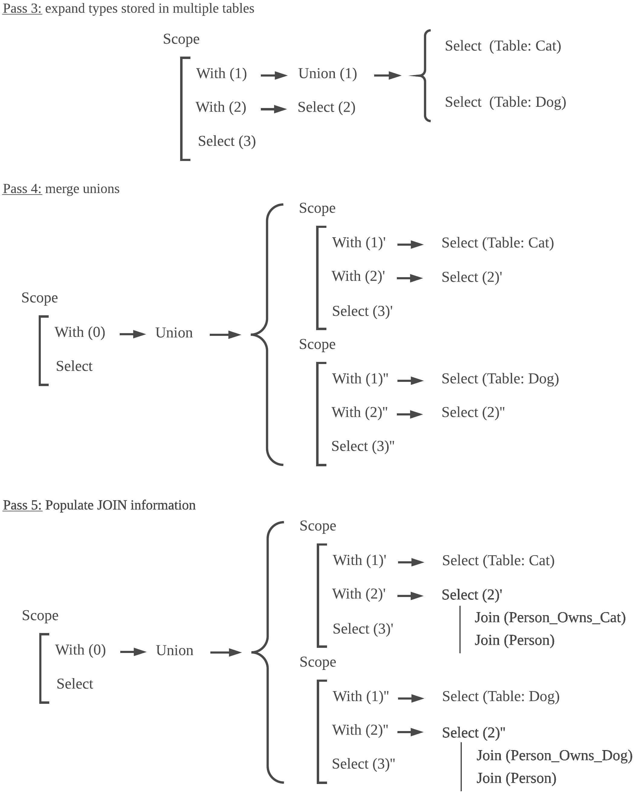

This module takes one or more queries, as generated by the Path Finder module, and builds the actual SQL.

The process of translating Cypher to SQL can be split into five major steps that are going to be detailed below. The Cypher query below will be used as a running example to help us understand the transformations.

```
Match (a: Pet)
Match (a)<-[:owns]-(b: Person)
Return a.registry_numbe
```

# Building Basic SQL Tree
The original Cypher Abstract Syntax Tree (AST), generated when parsing a query, is analysed using the visitor pattern in order to build an intermediate SQL representation tree, as shown under the label "pass 1" in the Figure below. The intermediate SQL tree is made of items that resemble SQL statements and are used in order to render the SQL query at the end of the translation process.

<p align="center">
  
</p>

In the first pass, all the Cypher information can be generically represented as a outer SELECT item with multiple nested WITH items in the intermediate SQL tree. Each of these WITH tree items contain other SELECT items. This process is shown on the figure above. In this stage, there is only one scope.

# Uncovering Variable Scope Definition

Cypher defines variables within a scope. As an example of scope definition, one can analyze variable `a`. The first Match statement defines variable `a` on the single scope and all the 'MATCH' sentences share the same variable `a`.
Similar to what Java does inside blocks or methods, Cypher allows, through the use of WITH statements, to redefine variables in a nested scope. In order to keep track of scope, it is important to be able to reference where each variable is defined.

On a second pass through the intermediate SQL tree, variable scope is analysed, as shown in the figure above, under "pass 2". Using scope analysis, it uncovers that `SELECT (1)` variable `a` and `SELECT (2)` variable `b` refer to information in the database. `SELECT (2)` variable `a` is defined in `WITH (1)` - thus creating a dependency between them, as represented by an arrow in the Figure above. `SELECT (3)` variables have a dependency with the variable used in `WITH (2)`.

Through this analysis, it is possible to uncover an undirect dependency of `SELECT (3)` to `WITH (1)`.


# Mapping to RDBMS

As shown below, a third analysis of the intermediate SQL tree uses gTop implementation layer information in order reference RDBMS tables.
`SELECT (1)` in the first Figure above becomes `UNION (1)`, since nodes of type Pet are actually split into tables Cat and Dog in the RDBMS.

<p align="center">
  
</p>

# Merging Unions

"Pass 4" in the Figure above shows the process of merging SQL UNION statements with other SELECT statements that are at the same nesting level.
`UNION (1)` and `SELECT (2)` are transformed into two different scopes, without UNION statements inside.

# Generating Traversals

The intermediate SQL tree is visited to resolve graph edges traversals, as shown in "pass 5". The implementation layer of gTop provides tables and column JOIN information in order to traverse from one node type to another. A new intermediate SQL tree JOIN item is added near the SELECT items, represented by `SELECT(2), SELECT(2)` and `JOIN` in the Figure above. Once this process is finished, the intermediate SQL tree is ready to be "rendered" into SQL statements.

# In a nutshell
Each Cypher MATCH statement will be mapped to a SELECT sub-query that will live in a SQL WITH statement. Several passes are executed to collect and build the equivalent SQL tree. A key part in the process is the analysis of variables lifetime and access patterns. The analysis causes the tree to have internal references aiming to provide extra information, such as source of information for variables (e.g table or other sub-query).

The final output of the process is a SQL query that performs equivalent to the input Cypher.
